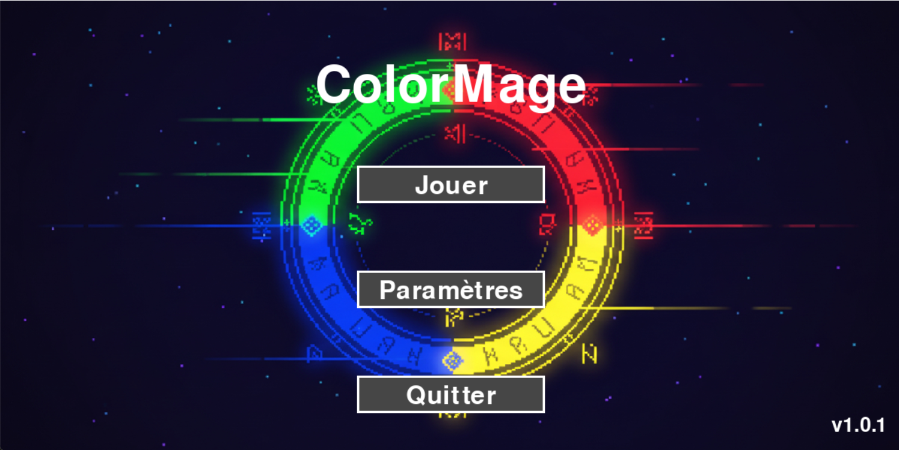
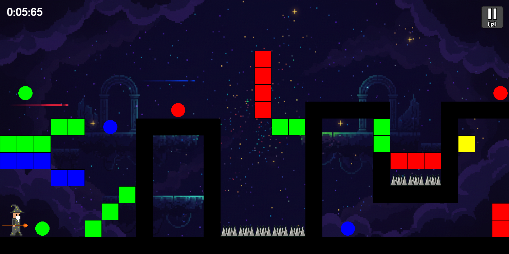

**ColorMage** est un jeu prototype développé en **Python** avec **Pygame**.

Dans ce jeu, vous incarnez un Mage capable de traverser des portails de couleurs afin de pouvoir naviguer dans des niveaux remplis d'obstacles. La clé du succès réside dans l'alignement : vous ne pouvez interagir qu'avec les éléments qui correspondent à la couleur de votre personnage.

## 🎮 Gameplay

Le joueur doit résoudre des parcours en changeant sa propre couleur pour pouvoir utiliser les plateformes et atteindre le portail final (jaune).

- Le Mage peut marcher sur les blocs de sa couleur et traverse ceux qui sont d'une couleur différente.
- Traverser un portail change la couleur du Mage (par exemple : traverser un portail vert → le Mage devient vert).
- L'objectif est d'atteindre le portail de sortie (portail jaune) en utilisant la bonne séquence de couleurs et de déplacements.

## ⚙ Installation

- **Sur Linux :**
    ```bash
    git clone https://github.com/Emrecan45/ColorMage.git
    cd ColorMage
    python3 -m venv venv 
    source venv/bin/activate
    pip install pygame
    python3 src/ColorMage.py
    ```

- **Sur Windows :**
    ```PowerShell
    git clone https://github.com/Emrecan45/ColorMage.git
    cd ColorMage
    pip install pygame
    python src/ColorMage.py
    ```

## 📷 Screenshots





## 🧠 Objectifs

**ColorMage** explore une mécanique de jeu innovante où couleur et stratégie sont essentielles. Le but est de créer un jeu amusant et stimulant, avec une difficulté progressive.


