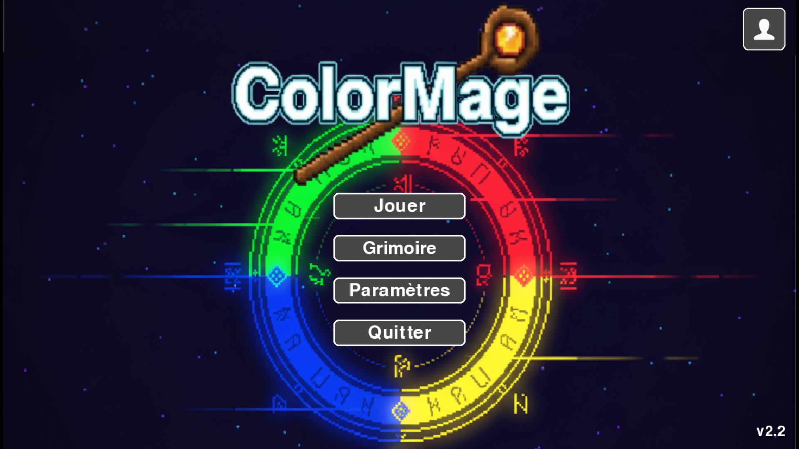
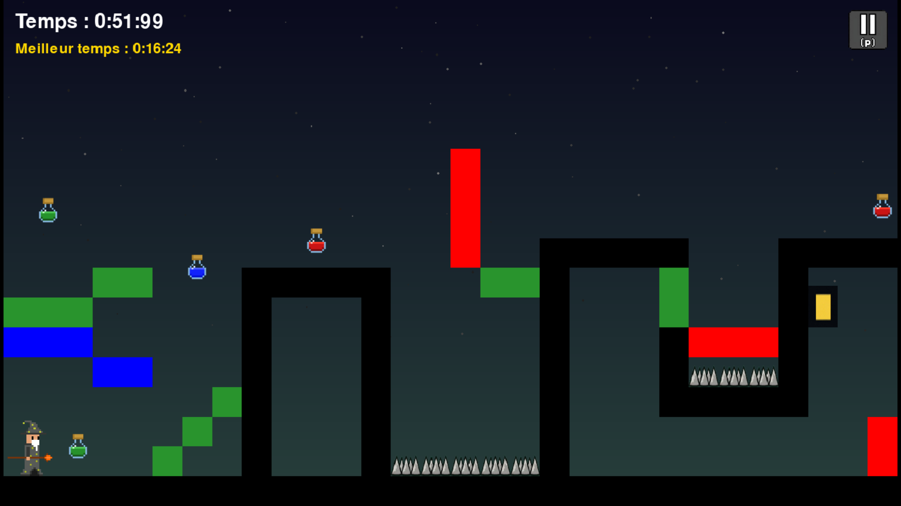

<div align="center">


**ColorMage** est un jeu de plateforme-puzzle développé en **Python** avec **Pygame**.

Vous incarnez un Mage capable de changer de couleur pour naviguer dans des niveaux remplis de plateformes, de pièges et d'ennemis.  
La clé du succès : vous ne pouvez interagir qu'avec les éléments qui correspondent à **votre couleur**.


</div>

---

## 📷 Screenshots

| Menu principal | Gameplay |
|:-:|:-:|
|  |  |

---

## 🎮 Gameplay

Le joueur doit résoudre des parcours en changeant sa couleur pour utiliser les plateformes et atteindre le portail de sortie jaune.

- **Blocs colorés** : le Mage marche sur les blocs de sa couleur et **traverse** les autres.
- **Potions de couleur** : ramasser une potion change la couleur du Mage (ex : potion verte → Mage vert).
- **Portail de sortie** : le portail jaune termine le niveau.
- **Pièces** : collectables cachés dans chaque niveau.
- **Pièges** : pics, ennemis mobiles, projectiles.

### Ennemis

| Ennemi | Description |
|--------|-------------|
| 🧙 Sorcier | Tire des projectiles dans sa portée |
| 💀 Squelette | Patrouille sur une zone définie |
| 🟢 Slime | Ennemi coloré, dangereux au contact |

### Blocs spéciaux

| Bloc | Effet |
|------|-------|
| Bloc mobile | Se déplace horizontalement ou verticalement |
| Potion de couleur | Change la couleur du Mage |
| Pic | Mort instantanée au contact |
| Pièce | +1 au compteur de pièces du profil |

---

## 🗺️ Niveaux

Le jeu contient actuellement **5 niveaux** jouables, répartis sur plusieurs planètes débloquées progressivement.  
Chaque niveau possède un **meilleur temps** enregistré. Un **Grimoire** se débloque au fil de l'aventure - à vous de le découvrir.

---

## 👤 Profil

- Pseudo personnalisable
- Avatar sélectionnable (déblocables en battant des ennemis)
- Statistiques : niveau max atteint, pièces collectées, temps de jeu total

---

## ⚙️ Installation

**Prérequis :** Python 3.8 ou supérieur

**Linux / macOS :**
```bash
git clone https://github.com/Emrecan45/ColorMage.git
cd ColorMage
python3 -m venv venv
source venv/bin/activate
pip install -r requirements.txt
python3 src/ColorMage.py
```

**Windows (PowerShell) :**
```powershell
git clone https://github.com/Emrecan45/ColorMage.git
cd ColorMage
pip install -r requirements.txt
python src/ColorMage.py
```

---

## 🕹️ Contrôles

| Action | Touche (défaut) |
|--------|-----------------|
| Aller à droite | `→` |
| Aller à gauche | `←` |
| Sauter | `↑` |
| Pause | `P` ou `Échap` |

> Les touches sont **reconfigurables** depuis le menu Paramètres.

---

## 🔧 Paramètres

- Remappage des touches (droite, gauche, sauter)
- Volume musique et effets sonores indépendants
- Export / Import de sauvegarde
- Réinitialisation de la progression

---

## 📁 Structure du projet

```
ColorMage/
├── src/               # Code source Python
│   ├── ColorMage.py   # Boucle principale du jeu
│   ├── niveau.py      # Chargement et rendu des niveaux
│   ├── joueur.py      # Logique du joueur
│   ├── enemies.py     # Ennemis et objets
│   ├── menu.py        # Menu principal
│   ├── profil.py      # Page profil
│   ├── parametres.py  # Paramètres (touches, volumes...)
│   ├── pause.py       # Menu pause
│   ├── popup.py       # Popups victoire / défaite / grimoire
│   ├── chronometre.py # Chronomètre en jeu
│   ├── alerte.py      # Notifications en overlay
│   ├── config_manager.py # Gestion de la sauvegarde
│   ├── config.py      # Constantes et configuration globale
│   ├── intro.py       # Écran d'introduction
│   └── menu_niveaux.py # Menu de sélection des niveaux
├── niveaux/           # Fichiers JSON des 40 niveaux
├── audio/             # Sons et musiques
├── img/               # Images, avatars, sprites
├── LICENSE            # Licence du projet (MIT)
├── CREDITS.md         # Crédits et sources des assets
├── .gitignore         # Fichiers à ignorer par Git
├── README.md          # Ce fichier
└── requirements.txt   # Dépendances
```

---

## 🧠 Conception

**ColorMage** explore une mécanique de jeu où **couleur et stratégie** sont indissociables.  
Chaque niveau est un puzzle de déplacement : anticiper les changements de couleur nécessaires pour progresser sans tomber dans le vide ou se faire tuer.

---

## 🎨 Crédits

Ce projet utilise des ressources graphiques originales et des contributions externes. La liste des auteurs et des sources associées est disponible dans le fichier [`CREDITS.md`](CREDITS.md).

---

## 📄 Licence

Ce projet est distribué sous licence **MIT**. Voir le fichier [`LICENSE`](LICENSE) pour plus de détails.

